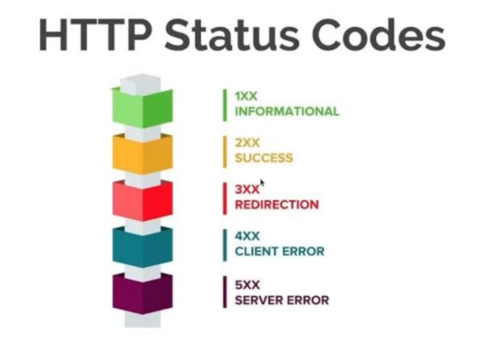

<h1>Estudando FastAPI</h1>
<strong>REST</strong> => Representational State Transfer (Transferência Representacional de Estado)

REST === RESTfull

<h2><strong>C</strong> => Create -> <strong>HTTP PUT</strong></h2>
<h2><strong>R</strong> => Retrive(Read) -> <strong>HTTP GET</strong> (posso pegar toda a coleção ou apenas um individual)</h2>
<h2><strong>U</strong> => Update -> <strong>HTTP POST</strong></h2>
<h2><strong>D</strong> => Delete -> <strong>HTTP DELETE</strong></h2>
 
<h2 syle='color:darkred;font-size:32'><strong>!!! HTTP É STATELESS !!!</strong></h2>
 
<h2>Cabeçalho da request - ACCEPT</h2>

 <strong>Accept:</strong> application/<strong>xml</strong>
 <strong>Accept:</strong> application/<strong>json</strong>
 <strong>Accept:</strong> application/<strong>pdf</strong>

 ACCEPT-LANGUAGE => Qual o idioma do conteúdo

 CACHE-CONTROL => Específica se o conteúdo pode ser conteúdo do cache e em quanto tempo o cache é atualizado

 <strong>Accept:</strong> application/<strong>xml</strong>

 

<h2>SESSÃO #02</h2>

Vamos utilizar o ambiente virtual VENV
python3.10 -m venv <nomeDoDiretorio>

source <nomeDoDiretorio>/bin/activate (Este comando ativa o venv)

pip3 freeze > requirement.txt gera um arquivo com todas as dependências que estamos utilizando em nosso projeto

<strong>GUNICORN</strong>

pip3 install gunicorn
gunicorn main:app -w 4 -k uvicorn.workers.UvicornWorker -> o gunicorn é um servidor mais parrudo
